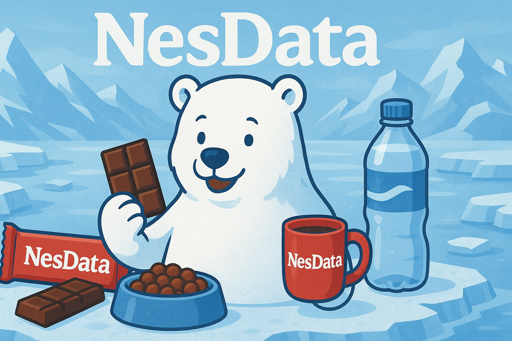
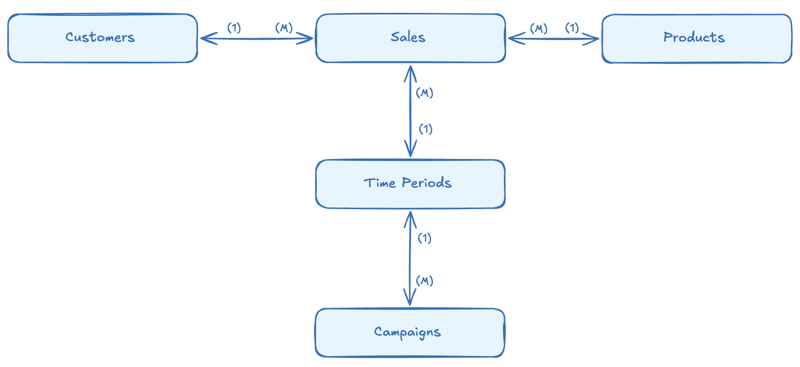
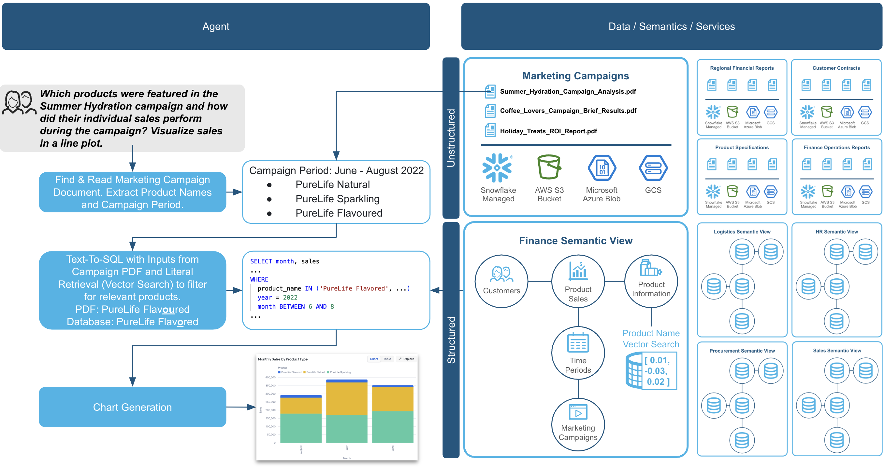

# NesData



## Overview
**NesData** is a global food and beverage company that creates products for everyday moments and special occasions. From chocolate and coffee to bottled water, frozen meals, and pet nutrition, NesData offers a diverse portfolio of trusted brands found in kitchens and pantries worldwide. Operating in over 180 countries, we combine quality ingredients with innovative food science to deliver taste, nutrition, and convenience. With a commitment to sustainable sourcing and responsible manufacturing, NesData helps families enjoy better food while supporting communities and environmental stewardship around the globe.

## Structured Data & Unstructured Data
This repository contains a **fictional financial dataset** from _NesData_. 
The Entity Relationship Model looks like this:  


In addition to that we also have unstructured data for marketing campaigns, customer contracts, financial reports and product specifications.

## Example Questions
### Selected Services:
These questions are meant to be used in Snowflake Intelligence since they require complex planning, multi-tool use and graph generation.

### **Questions for Structured Data**
These queries operate on structured, tabular data sources.

| Question | Query Complexity |
|----------|---------|
| What was the total revenue for 2023? | 🟢 **Easy** |
| What's the average unit price of Chocolate products? | 🟢 **Easy** |
| What was the monthly revenue for nescafe classic and gold in 2023? Visualize revenue per product per month in a line chart. | 🟡 **Medium** |
| What are the top 5 best-selling products by quantity? | 🟡 **Medium** |
| Which customer type generates the highest gross profit? | 🟡 **Medium** |
| What's the profit margin by product category? | 🟡 **Medium** |
| Show regional performance for Q1 2023. | 🟡 **Medium** |
| Visualize revenue per week and region for 2023 in a line chart. | 🟡 **Medium** |
| Visualize the monthly revenue in 2023 for customer freshmart central as a line plot. | 🔴 **Hard** |
| Which products had sales growth above 20% comparing Q4 2023 vs Q4 2022? | 🔴 **Hard** |
| What's the impact of marketing campaigns on sales performance? Compare sales with and without marketing campaigns using our sales data. | 🔴 **Hard** |
| Find customers who buy products from at least 4 different categories and rank them by total spend. | 🔴 **Hard** |
| Calculate the 3-month rolling average revenue for each product category. | 🔴 **Hard** |
| Identify seasonal patterns: which products peak in which quarters across all years? | 🔴 **Hard** |

### **Questions requiring Structured + Unstructured Data**  
These queries analyze text-based documents.

| Question | Query Complexity |
|----------|---------|
| What was the budget for the Coffee Lovers campaign and what were the actual coffee sales during that period? | 🔴 **Hard** |
| Which products were featured in the Summer Hydration campaign and how did their individual sales perform during the campaign? Visualize sales in a line plot. | 🔴 **Hard** |
| Analyze the Holiday Treats campaign's claim of $5.2M incremental revenue against actual chocolate sales data. | 🔴 **Hard** |
| Compare our reported coffee category performance with actual sales transactions in 2023. | 🔴 **Hard** |
| What were our regional revenue figures for 2023 from our sales data and how do they compare to our regional reports from 2023? | 🔴 **Hard** |
| Compare premium vs. standard product performance - which NesKafe products have higher margins and what differentiates them? | 🔴 **Hard** |

## What makes questions hard?

This demonstration goes far beyond simple Text-to-SQL or RAG use cases. Let's examine what happens behind the scenes when you ask the following question:

> **"Which products were featured in the Summer Hydration campaign and how did their individual sales perform during the campaign? Visualize sales in a line plot."**



### 1. Document Analysis
The agent first identifies that this question requires finding the relevant PDF containing information about the marketing campaign, including which products were included.

It discovers the following products:
- **PureLife Natural**
- **PureLife Sparkling** 
- **PureLife Flavoured**

It also recognizes that the campaign is run between **June - August 2022** which it correctly translates into the right filter criteria for the SQL query.

### 2. Complex SQL Generation
With the products and campaign period identified from the PDF document, the agent creates a sophisticated SQL query:

```sql
SELECT
    t.month_name,
    p.product_name,
    SUM(s.total_revenue) AS monthly_sales
FROM
    cortex_agents_demo.finance_food_beverage.sales s
    INNER JOIN cortex_agents_demo.finance_food_beverage.products p ON s.product_id = p.product_id
    INNER JOIN cortex_agents_demo.finance_food_beverage.time_periods t ON s.period_id = t.period_id
WHERE
    p.product_name IN (
        'PureLife Natural',
        'PureLife Sparkling',
        'PureLife Flavored'
    )
    AND t.year = 2022
    AND t.month IN (6, 7, 8)
GROUP BY
    t.month_name,
    t.year,
    p.product_name
ORDER BY
    t.month_name DESC NULLS LAST,
    p.product_name;
```

### 3. Intelligent Name Matching
**Note:** The product names from the PDF are not identical to those in the dataset. Did you notice the difference?

- **PDF**: "PureLife Flav**ou**red"
- **Database**: "PureLife Flav**o**red"

The agent handles this discrepancy by utilizing [Snowflake's Cortex Search integration for Semantic Models](https://docs.snowflake.com/en/user-guide/snowflake-cortex/cortex-analyst/cortex-analyst-search-integration), which enables dynamic retrieval of relevant literals using hybrid search (combining lexical search with embedding search).

### 4. Visualization Generation
Finally, the agent generates the requested chart using the `data_to_chart` tool that is available to all agents by default.
